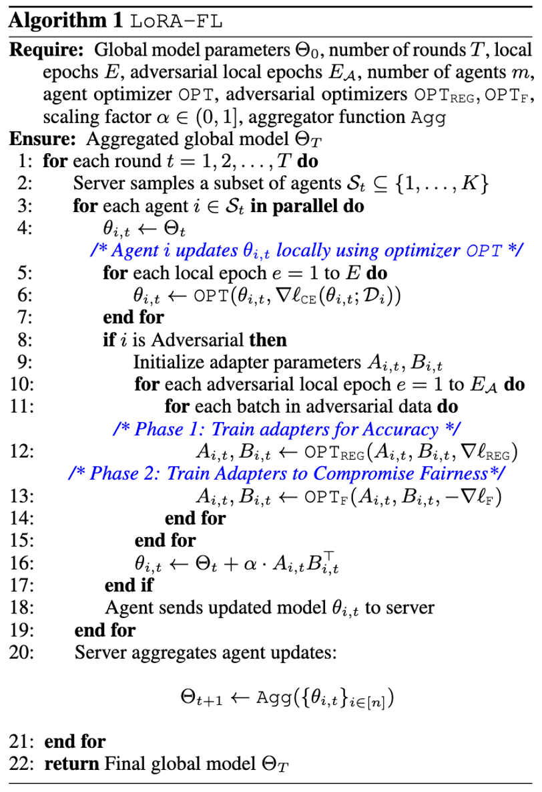

# 🚨 LoRA-FL: A Low-Rank Adversarial Attack for Compromising Group Fairness in Federated Learning

---

## 📄 Summary

**Title**: *LoRA-FL: A Low-Rank Adversarial Attack for Compromising Group Fairness in Federated Learning*

**Authors**: *Sankarshan Damle, Ljubomir Rokvic, Venugopal Bhamidi, Manisha Padala, Boi Faltings*

**Workshop**: [ICML 2025 Workshop on Collaborative and Federated Agentic Workflows (CFAgentic)](https://cfagentic.github.io/)

---

## 🔍 Abstract

Federated Learning (FL) enables distributed model training without sharing raw data, but underlying client distributions, or biased client data can lead to unfair outcomes across sensitive demographic groups. Existing fairness attacks either harm accuracy or are blocked by robust aggregators like **KRUM**.

We propose **LoRA-FL**: a stealthy adversarial attack that injects bias using **low-rank adapters** while closely mimicking benign updates. By operating in a compact parameter subspace, LoRA-FL:

* Preserves accuracy
* Evades robust aggregation defenses
* Degrades fairness metrics (e.g., DP, EO) by **40%+** with just **10–20%** adversarial agents

This reveals a serious vulnerability in FL’s fairness-security tradeoff.

---

## 🧐 LoRA-FL Algorithm

LoRA-FL introduces a two-phase adversarial strategy:

1. **Accuracy Phase**: Adapters are trained to preserve task performance.
2. **Fairness Attack Phase**: The same adapters are fine-tuned to **maximize fairness loss**, thereby harming group fairness.

Adversarial agents compute a biased model update:

```
Θᵢ,ₜ ← Θₜ + α · Aᵢ,ₜ Bᵢ,ₜꜛ
```

where `Aᵢ,ₜ`, `Bᵢ,ₜ` are low-rank matrices optimized adversarially.

### 📊 Algorithm 1: LoRA-FL Training Loop




---

## 🚀 Getting Started

### 1. Clone the Repository

```bash
git clone https://github.com/sankarshandamle/LoRA-FL.git
cd LoRA-FL
```

### 2. Install Dependencies and Export Python Path

```bash
pip install -r requirements.txt
export PYTHONPATH=$(pwd)
```

### 3. Run the Trainer

```bash
python main.py <config_name.yml> <NO_RUNS>
```

### 4. Or Use Predefined Scripts

```bash
bash run_experiments_adult.sh
```

---

## 📊 Datasets

* Adult Census
* Bank Marketing
* Dutch Census

> These binary classification datasets include protected group attributes for fairness evaluation.

---

## 📈 Metrics

* **Accuracy**
* **Demographic Parity (DP)**
* **Equal Opportunity (EOpp)**
* **Equalized Odds (EO)**

LoRA-FL reduces fairness metrics by over 40% while maintaining high task performance.

---

## 🔒 Defense Evasion

LoRA-FL successfully evades robust aggregators such as:

* **KRUM**
* **Trimmed Mean**

This is due to the subtle, low-rank nature of its perturbations.

---

## 📢 Citation

If you use this work, please cite:

```bibtex
@inproceedings{damle2025lora,
  title={LoRA-FL: A Low-Rank Adversarial Attack for Compromising Group Fairness in Federated Learning},
  author={Damle, Sankarshan and Rokvic, Ljubomir and Bhamidi, Venugopal and Padala, Manisha and Faltings, Boi},
  booktitle={ICML Workshop on Collaborative and Federated Agentic Workflows (CFAgentic)},
  year={2025}
}
```

---

## 🧪 Acknowledgements

This research was conducted at  LIA, EPFL in collaboration with IIT Gandhinagar.

---


